# Cart

The cart component is written using NodeJS framework, and implements the functionality of adding catalogue iteams to cart. Its makes use of the redis component to store the items to cart for a session.

</br>

## BUILD INSTRUCTION
---

The following steps are to be performed to build the cart component

- **TEST CODE QUALITY**
 
    **[ Note before moving on to this step complete the [_sonarqube-setup_](../../CD), [_jenkins-setup_](../../CD) ]**

    1. **STEP 1** - Create a repository in github and unzip [_cart-source-code_](../../Source-Code/cart/cart.zip) and place the unzipped files under code directory, copy the [Code-Quality-Jenkinsfile](Code-Quality-Jenkinsfile), [sonar-project.properties](sonar-project.properties), to the root directory of the same repository. 

    </br>

    2. **STEP 2** - Install and Configure SonarScanner jenkins pulgin, follow the below steps :-

        - Login in to jenkins console, go to **Jenkins Dashboard > Manage Jenkins > Manage Pulgins > Available Pulgins > Search for SonarScanner Pulgin > Select the pulgin > Click Download now and install after restart**

        </br>

        

       </br>

       -  Once Downloaded , click on restart jenkins.
       </br>
 
       - Create sonar authenticatio token for jenkins , do the following **login into the Sonarqube server > Go to Administration tab > security > Users > Click on the icon below Token**

        </br>

        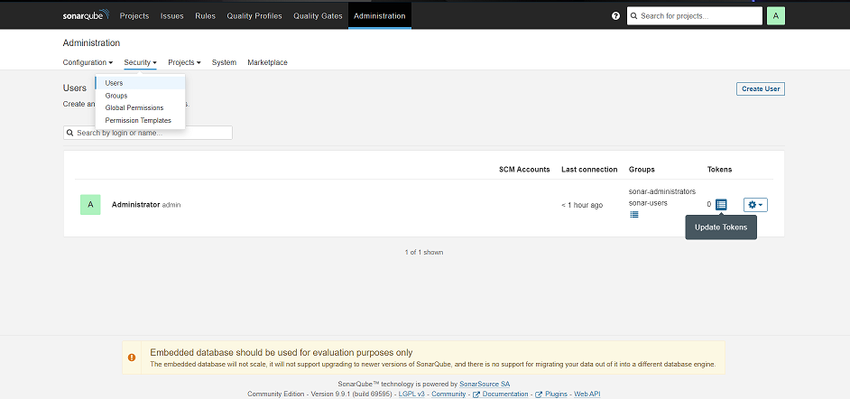

        <br>

        - In the dialogue box that appears **Give a Name > Select expiration period > Click Generate**

        </br>

        
        
        <br>

        - Copy the generated Token.

        </br>

        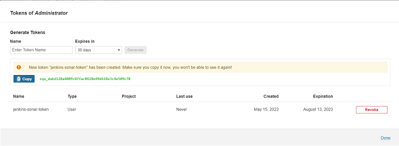

        </br>

        - Save token as secret in  Jenkins **Go to Manage Jenkins > Credentials > System > Global credentials > Click on Add credential on top right > Select Secret Text > Scope global > Paste the generated token in Secret > Give a random ID and description > Click create**

        </br>

        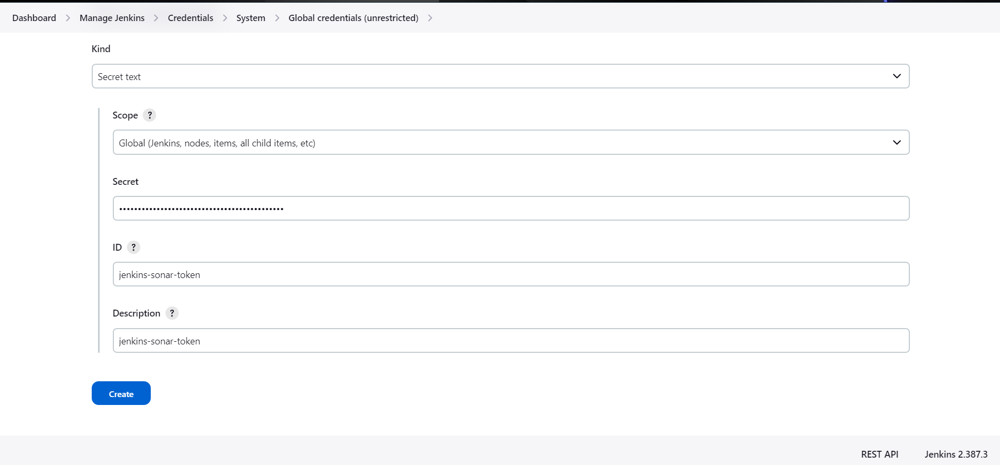
       
        </br>

        - Add Sonarqube sever configuration in Jenkins **Go to Manage Jenkins > Configure System > Scrool down to SonarQube server > Check Environmental variable > Click Add SonarQube**

        </br>

        
        
        </br>

        - In the dialogue box that opens **Give name as sonar-server [ _dont change_ ] > Give Server URL in following format "_http://{sonarqube-server-IP}:{sonarqube-port}_" > Select the previously added token for Server authentication Token > Click Save**

        </br>

        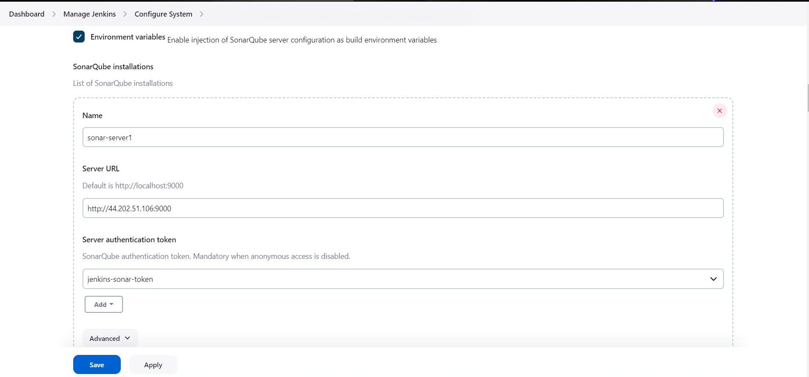
        
        </br>

        - Install SonarScanner for analysis in Jenkins **Go to Jenkins > Manage Jenkins > Global Tool Configuration > Scrool down to SonarQube Scanner section > Click on Add SonarQube Scanner**

        </br>

        
       
        </br>

        - In the dialogue box that opens **Give the name as Sonarscanner-4.8.0 [ _dont change_ ] > Select install automatically > Install from Maven Central > Select the 4.8.0 version > Click Save**

        </br>

        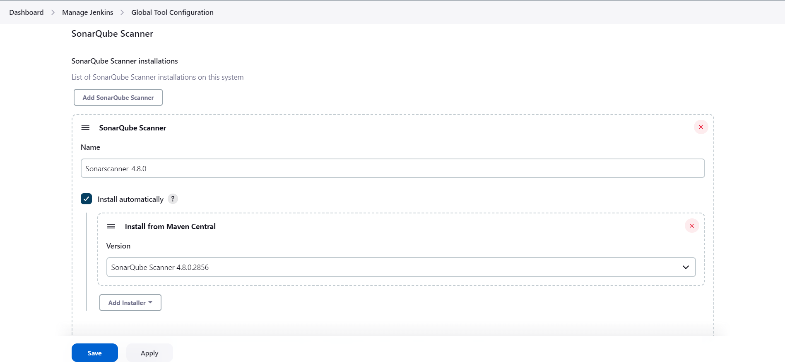
        
        </br>

    2. **STEP 3** - Create Webhook for jenkins in sonar to communicate the quality gate passing. Follow the below steps

        - Login to SonarQube server **Go to Administration > Configuration > Select Webhook > Click create**

        </br>

        
        
        </br>

        - In the dialogue box that opens **Give a random name > Give the URL as follows "_http://{jenkins-server-IP}:{jenkins-port}/sonarqube-weebhook/_" > Leave secret as empty > Click Create**

        </br>

        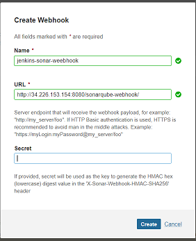

        </br>


    2. **STEP 4** - Create a SonarQube Project and setup quality gates, Follow the below steps.

        - Login to SonarQube Server **Go to Projects > Select Manual**

        </br>

        

        </br>

        - In the next page **Give a Project Name > Project Key > Leave branch as main > Click Setup**

        </br>

        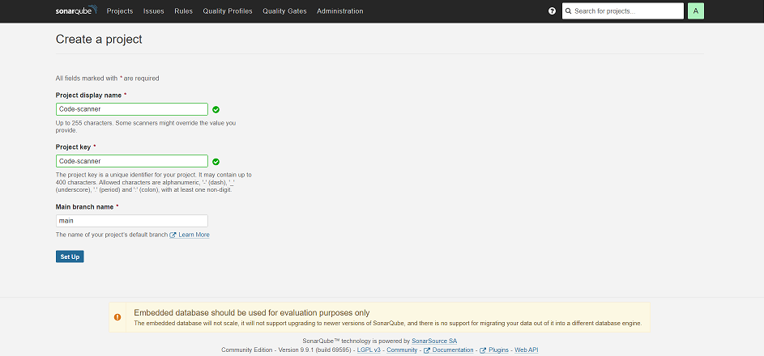

        </br>

        - In the next page **Select With Jenkins > Skip through the tutorial presented and setup the project**

        </br>

        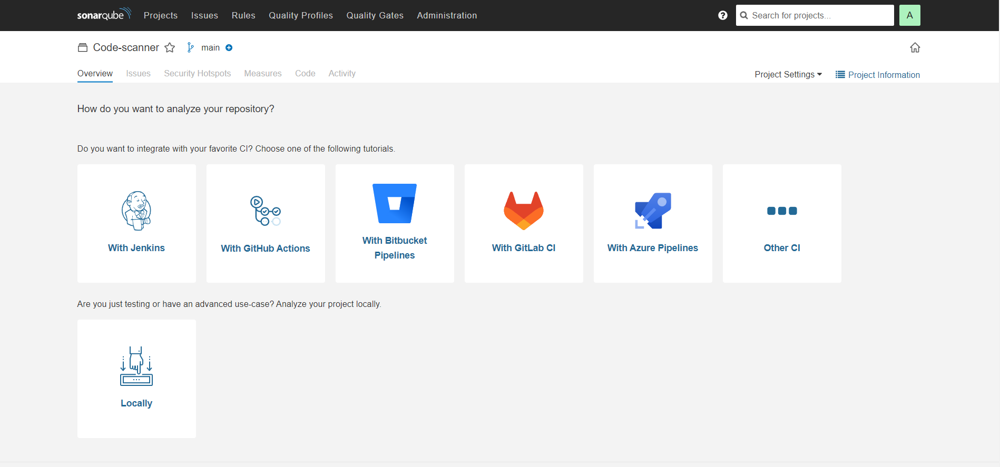

        </br>

        - Inorder to setup quality gates for the project **Go to Quality Gates > Click Create > In the dialogue box that appears > Select the Quality profile > Select the metrics and passing score > Click create**


        </br>

    1. **STEP 5** - Create Jenkins job to perfrom code quality analysis, follow the below steps.
     
        - Create the [Code-Quality-Jenkinsfile](Code-Quality-Jenkinsfile) [ **_don't change the filename_** ] file with the necessary steps to run in jenkins job.


        - Login to the jenkins console,
        Create an job by cliking on **New Item > Select Pipeline > Enter the name of the job > Ok**

        </br>

        

        </br>


        - Configure the created jenkins job, setup the Pipelince section **Choose Pipeline script fron SCM > Setup Respository URL > Setup the credentials > Set the branch specfier to main branch of your remote repo > Set the Script Path to _/CI/Build/catalogue/Code-Quality-Jenkinsfile_ > Click Save**


        - Configure github webhook **Login to Github > Go to the specific repository > Settings > Webhook > Add webhook > Payload URL as "jenkins URL:port/github-webhook/" > Content type as _application/json_ > Add webhook**

        </br>


        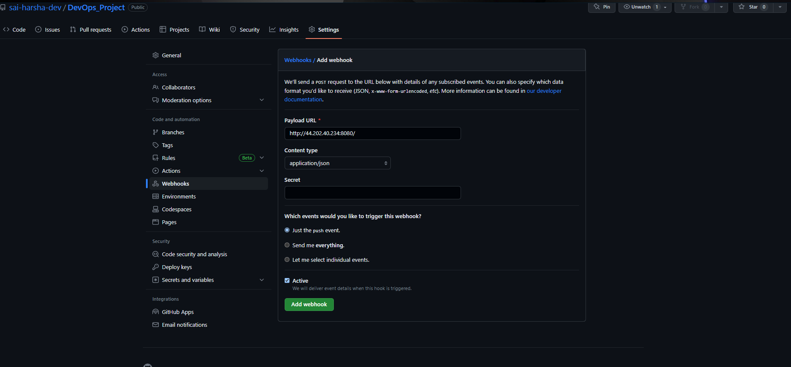

        </br>

        - Go back to jenkins **Select the created Job > Configure > Build Triggers > Select _GitHub hook trigger for GITScm polling_ > Click save**  ( _This is enabled so that job gets triggered automatically when new commits are made to source code repo in GitHub_ )
        
        </br>

        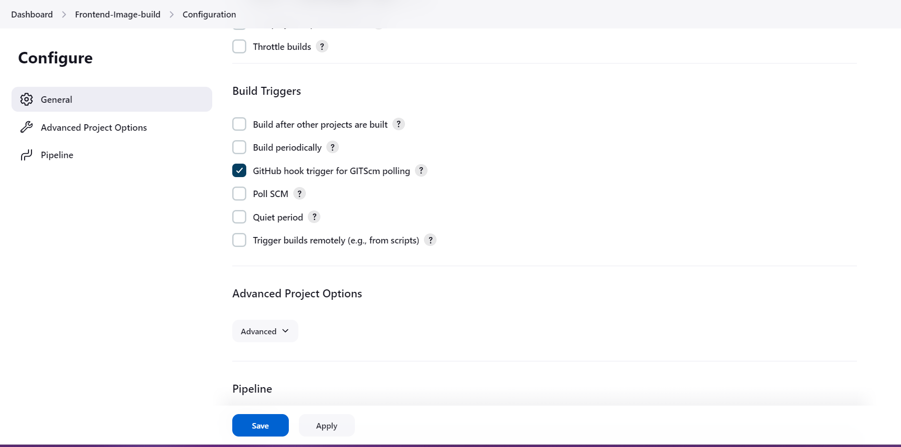


</br>

- **CREATE CONTAINER IMAGE**

    1. **STEP 1** - Create the [Dockerfile](Dockerfile) [ **_don't change the filename_** ] file with the necessary instruction to build docker image. 

    2. **STEP 2** - Create the [Jenkinsfile](Jenkinsfile) [ **_don't change the filename_** ] file with the necessary steps to run in jenkins job.

    2. **STEP 3** -  Create a Jenkins job [ **complete the [jenkins_setup](../../CD) section before performing this step** ], follow the mentioned steps below.

        - Login to the jenkins console, use the username and password setup in the [jenkins_setup](../Images/../../CD) section

        </br>

        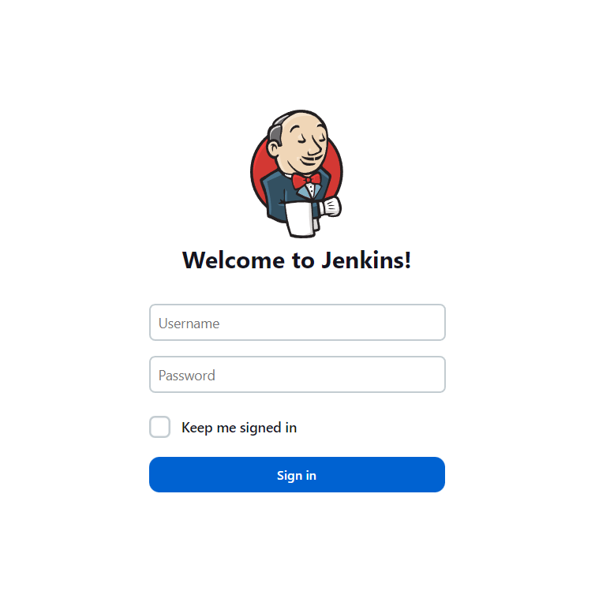

        </br>
        
        - Create an job by cliking on **New Item > Select Pipeline > Enter the name of the job > Ok**
        
        </br>

        

        </br>

        - Configure the created jenkins job, setup the Pipelince section **Choose Pipeline script fron SCM > Setup Respository URL > Setup the credentials > Set the branch specfier to main branch of your remote repo > Set the Script Path to _/CI/Build/catalogue/Jenkinsfile_ > Click Save**

        </br>
        
        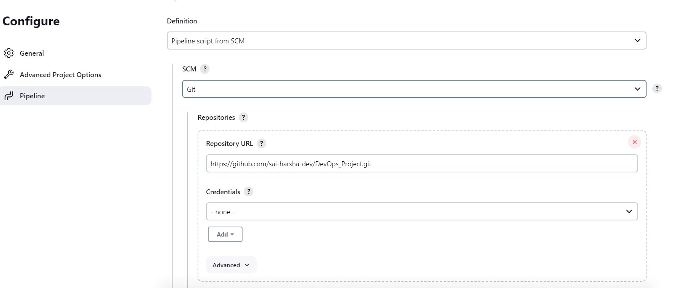

        </br>

        

        </br>


    4. **STEP-4** - Setup nexus repository [_refer_](../../CD), and then configure a new docker repo by following the below mentioned steps 

        -  Click on **Settings option on top menu bar >   Repository in left pane > Choose docker(hosted)**

         </br>

         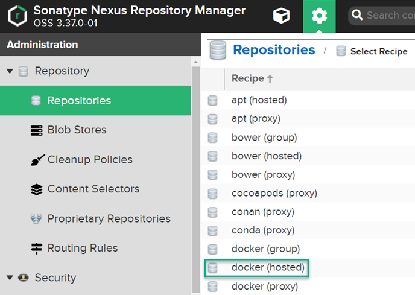

         </br>

        -  Now **Enter a repository name > Enter a preffered HTTP port (use a port different fro the one used in other repo) > Enable Docker API > Create Repository**

        </br>

         

         </br>
 

    2. **STEP-5** - Configure nexus user credentials in jenkins. ( not needed if alreaady done in frontend build ) 

        - **Go to Jenkins Dashboard > Manage Jenkins > Under security manage credentials > System > Global credentials > Add credentials.** 

        </br>

        

        </br>

        - In new crendentials dropdown **Select Secret Text > Scope Global > In Secret input nexus admin password > Id "nexus-password" > Description "nexus-password" > Click create**.
        
        </br>

        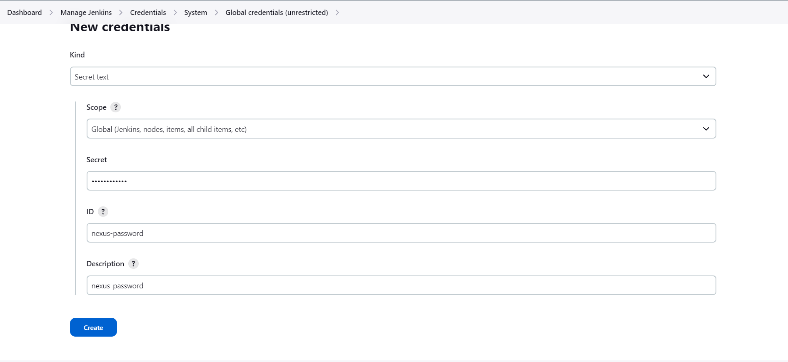

        
        </br>

    2. **STEP-6** - Setup the downstream job necessary to update the helm chart files [ [**_here_**](https://github.com/sai-harsha-dev/DevOps_Project_HelmChart.git) ] with updated Image tag to the manifest files. Do the following steps in jenkins console.
        
        -  Install the **Git Publish** pulgin before configuring the job, follow these steps **Go to Jenkins Dashboard > Manage Jenkins > Manage Pulgins > Available Pulgins > "Git plugin" >
        Check Download and Install after restart**

        </br>

        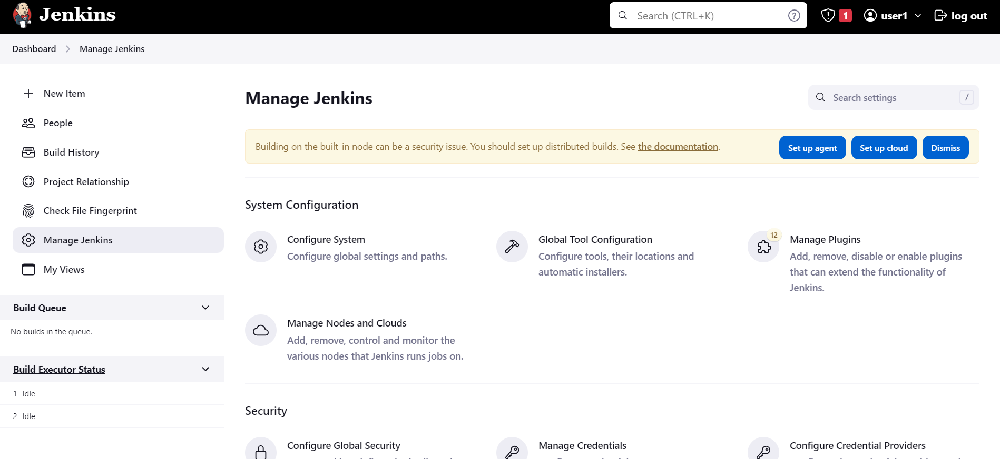

        </br>

        
        
        </br>
 

        -  After restarting the server, Configure the jenkins downstream job from **Jenkins Dashboard > New Item > Select Freestyle job > Give a name to the job > Click OK**

        </br>

        

        </br>

        - Configure the job as follows **Check This project is parameterized option > Select string parameter > Give a name ( _should be same a given in [jenkins](Jenkinsfile) file post section parameters_ ) > Give a default value.**

        </br>

         
        
        </br>


        

        </br>

        - Login into Github and generate github tokens using the following steps **Under Profile icon select Settings > In the left menu bar Developer setting > Personal access token > Tokens ( classic ) > Generate new token > Generate new token ( classic )**

        </br>

        

        </br>

        - **Give a note > Expiration period > Select Scope (_Click Rep_) > Generate Token > Copy the Token**

        </br>

        - Go back to Jenkins job configuration console in the Source Code Management section **Select Git > Give repository URL (_git repo where helm charts are found i.e [**_here_**](https://github.com/sai-harsha-dev/DevOps_Project_HelmChart.git)) > Select the credentials > Add Credentials > Jenkins > Select Username and Password > Global > Under Username your git profile name > Password the generated token > ID random name > Description random > Click Add > Input branch specifier as per your main branch name**

        </br>

        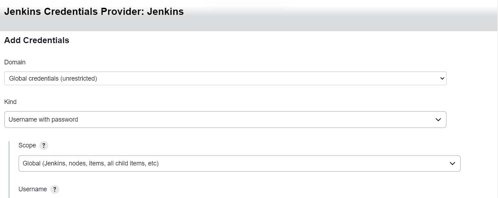
        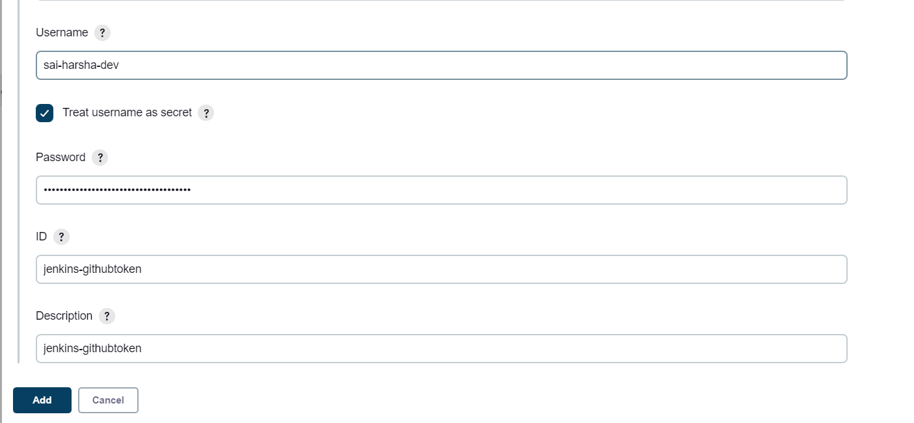

        </br>
        
        

        </br>

        - In the build steps **Click Add build step > Select Execute Shell > In the Command section give the following commands.**

        </br>

        ```console
           sed -i '/^image:.*$/d' templates/cart/values.yaml
           echo "image: ${IMAGE}" >> templates/cart/values.yaml 
           git add templates/cart/values.yaml
           git commit -m "updated image to ${IMAGE}" 
        ```
        
        </br>

        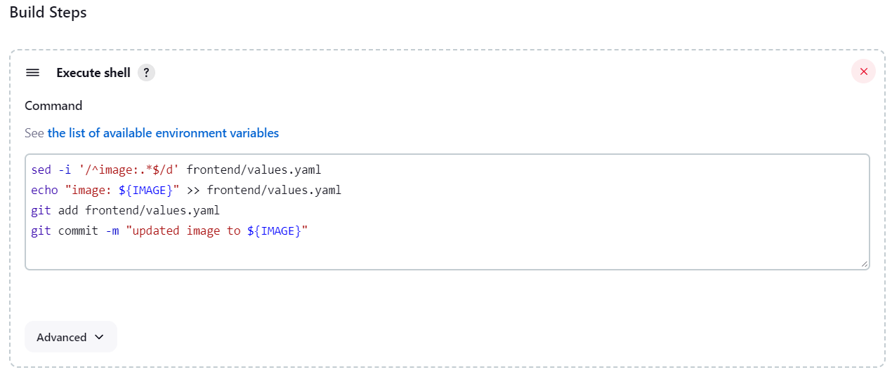
        
        </br>

        - In Post Build Section **Add post build action > Git publisher > Select Push Only If Build Succeeds > Input remote branch to push to in Branch to push > The remote url (_i.e upstream URL_) name in Target remote name > Click Save.**k

        </br>

        
        
        </br>

        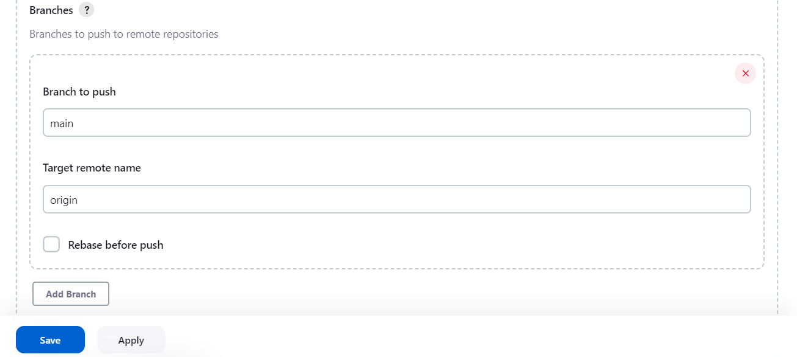

        </br>
        
    2. **STEP-7** - Go to the jenkins upstream-job ( _**Refer STEP 3**_ ) and perform following steps to build frontend image & Trigger downstream job to update image tag in helm charts  ( not needed if alreaady done in frontend build ) 

        - Add jenkins user to docker group, run the following commands by SSHing into jenkins server. ( Done to avoid prefixing sudo with docker commands )

            ```console
            ubuntu@ip-172-31-83-151:~$ sudo usermod -aG docker jenkins
            ubuntu@ip-172-31-83-151:~$ sudo systemctl restart jenkins
            ```

        - **Login to the jenkins console > Click on the created job > Enter the parameter values (run once to get the listing) > Build with parameters.** 

        </br>

        
        

        </br>

### Next Step
---

Go to the [_Build_](../../Build/) for folder for instructions to build the rest of the components left. 
        

        

        
    
          