# Mysql

These are steps to be followed to configure and build mysql database.

</br>

## BUILD INSTRUCTION
---

The following steps are to be performed to build the mongodb component

- **CREATE CONTAINER IMAGE**

    1. **STEP 1** - Create the [Dockerfile](Dockerfile) [ **_don't change the filename_** ] file with the necessary instruction to build docker image. 

    2. **STEP 2** - Create the [Jenkinsfile](Jenkinsfile) [ **_don't change the filename_** ] file with the necessary steps to run in jenkins job.

    2. **STEP 3** -  Create a Jenkins job [ **complete the [jenkins_setup](../../CD) section before performing this step** ], follow the mentioned steps below.

        - Login to the jenkins console, use the username and password setup in the [jenkins_setup](../Images/../../CD) section

        </br>

        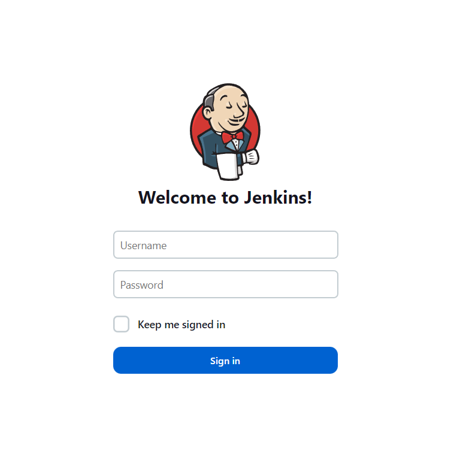

        </br>
        
        - Create an job by cliking on **New Item > Select Pipeline > Enter the name of the job > Ok**
        
        </br>

        

        </br>

        - Configure the created jenkins job, setup the Pipelince section **Choose Pipeline script fron SCM > Setup Respository URL > Setup the credentials > Set the branch specfier to main branch of your remote repo > Set the Script Path to _/CI/Build/frontend/Jenkinsfile_ > Click Save**

        </br>
        
        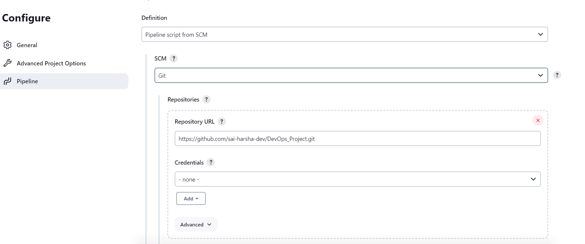

        </br>

        

        </br>

        - Configure github webhook **Login to Github > Go to the specific repository > Settings > Webhook > Add webhook > Payload URL as "jenkins URL:port/github-webhook/" > Content type as _application/json_ > Add webhook**

        </br>


        

        </br>

        - Go back to jenkins **Select the created Job > Configure > Build Triggers > Select _GitHub hook trigger for GITScm polling_ > Click save**  ( _This is enabled so that job gets triggered automatically when new commits are made to source code repo in GitHub_ )
        
        </br>

        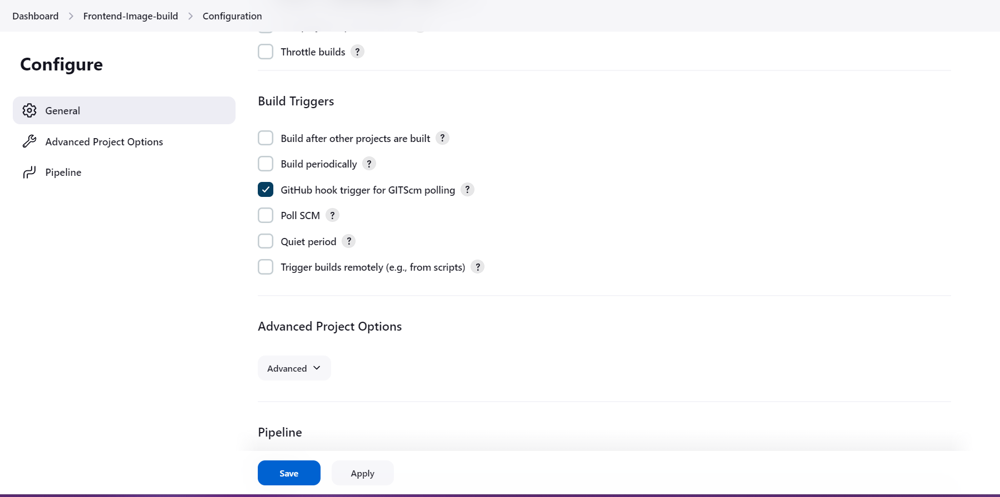

        </br>

    4. **STEP-4** - Setup nexus repository [_refer_](../../CD), and then configure a new docker repo by following the below mentioned steps 

        -  Click on **Settings option on top menu bar >   Repository in left pane > Choose docker(hosted)**

         </br>

         

         </br>

        -  Now **Enter a repository name > Enter a preffered HTTP port (use a port different fro the one used in frontend repo) > Enable Docker API > Create Repository**

        </br>

         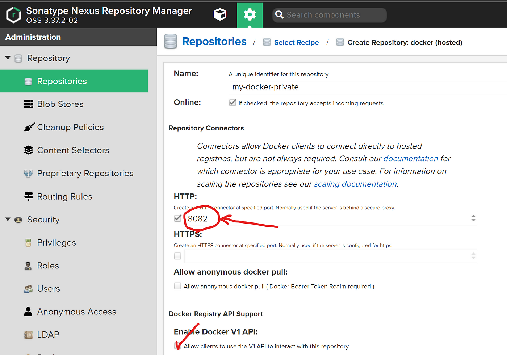

         </br>
 

    2. **STEP-5** - Configure nexus user credentials in jenkins. ( not needed if alreaady done in frontend build ) 

        - **Go to Jenkins Dashboard > Manage Jenkins > Under security manage credentials > System > Global credentials > Add credentials.** 

        </br>

        

        </br>

        - In new crendentials dropdown **Select Secret Text > Scope Global > In Secret input nexus admin password > Id "nexus-password" > Description "nexus-password" > Click create**.
        
        </br>

        

        
        </br>

    2. **STEP-6** - Setup the downstream job necessary to update the helm chart files [ [**_here_**](https://github.com/sai-harsha-dev/DevOps_Project_HelmChart.git) ] with updated Image tag to the manifest files. Do the following steps in jenkins console.
        
        -  Install the **Git Publish** pulgin before configuring the job, follow these steps **Go to Jenkins Dashboard > Manage Jenkins > Manage Pulgins > Available Pulgins > "Git plugin" >
        Check Download and Install after restart**

        </br>

        

        </br>

        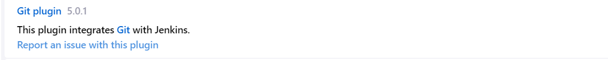
        
        </br>
 

        -  After restarting the server, Configure the jenkins downstream job from **Jenkins Dashboard > New Item > Select Freestyle job > Give a name to the job > Click OK**

        </br>

        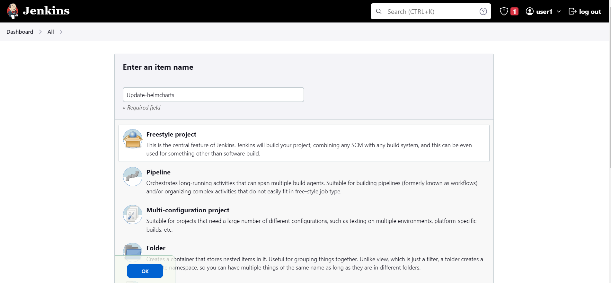

        </br>

        - Configure the job as follows **Check This project is parameterized option > Select string parameter > Give a name ( _should be same a given in [jenkins](Jenkinsfile) file post section parameters_ ) > Give a default value.**

        </br>

         
        
        </br>


        

        </br>

        - Login into Github and generate github tokens using the following steps **Under Profile icon select Settings > In the left menu bar Developer setting > Personal access token > Tokens ( classic ) > Generate new token > Generate new token ( classic )**

        </br>

        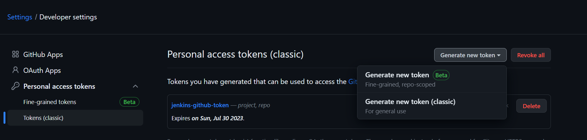

        </br>

        - **Give a note > Expiration period > Select Scope (_Click Rep_) > Generate Token > Copy the Token**

        </br>

        - Go back to Jenkins job configuration console in the Source Code Management section **Select Git > Give repository URL (_git repo where helm charts are found i.e [**_here_**](https://github.com/sai-harsha-dev/DevOps_Project_HelmChart.git)) > Select the credentials > Add Credentials > Jenkins > Select Username and Password > Global > Under Username your git profile name > Password the generated token > ID random name > Description random > Click Add > Input branch specifier as per your main branch name**

        </br>

        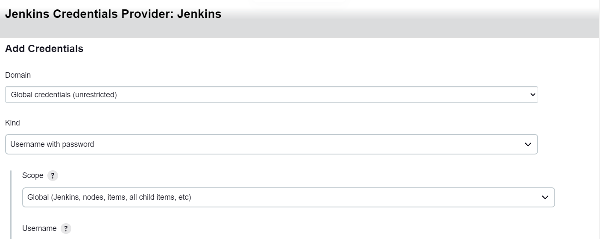
        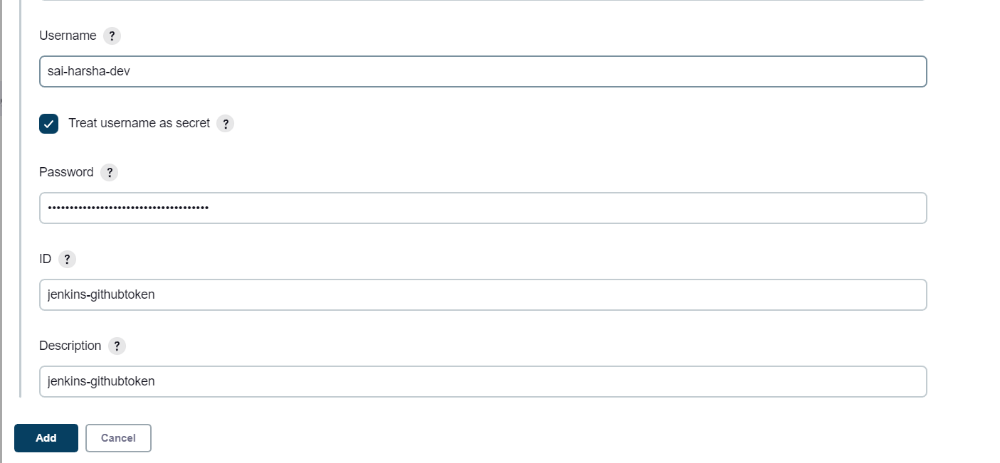

        </br>
        
        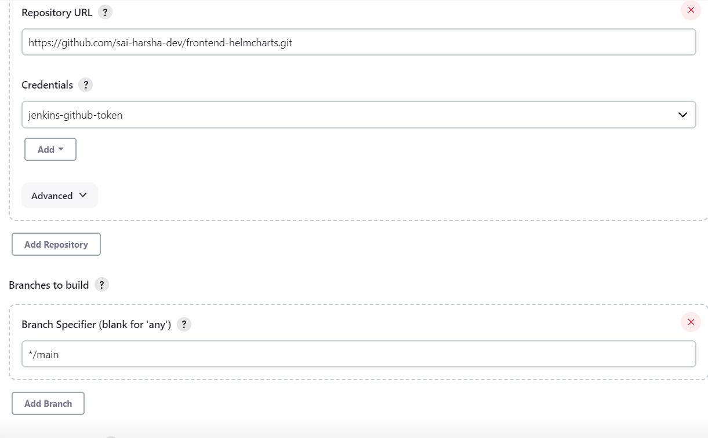

        </br>

        - In the build steps **Click Add build step > Select Execute Shell > In the Command section give the following commands.**

        </br>

        ```console
           sed -i '/^image:.*$/d' templates/mysql/values.yaml
           echo "image: ${IMAGE}" >> templates/mysql/values.yaml 
           git add templates/mysql/values.yaml
           git commit -m "updated image to ${IMAGE}" 
        ```
        
        </br>

        
        
        </br>

        - In Post Build Section **Add post build action > Git publisher > Select Push Only If Build Succeeds > Input remote branch to push to in Branch to push > The remote url (_i.e upstream URL_) name in Target remote name > Click Save.**

        </br>

        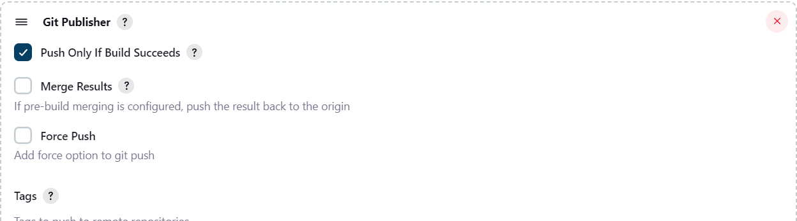
        
        </br>

        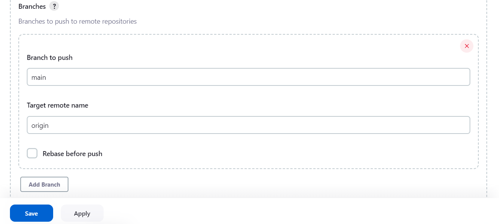

        </br>
        
    2. **STEP-7** - Go to the jenkins upstream-job ( _**Refer STEP 3**_ ) and perform following steps to build frontend image & Trigger downstream job to update image tag in helm charts  ( not needed if alreaady done in frontend build ) 

        - Add jenkins user to docker group, run the following commands by SSHing into jenkins server. ( Done to avoid prefixing sudo with docker commands )

            ```console
            ubuntu@ip-172-31-83-151:~$ sudo usermod -aG docker jenkins
            ubuntu@ip-172-31-83-151:~$ sudo systemctl restart jenkins
            ```

        - **Login to the jenkins console > Click on the created job > Enter the parameter values (run once to get the listing) > Build with parameters.** 

        </br>

        
        

        </br>

### Next Step
---

Go to the [_Build_](../../Build/) for folder for instructions to build the rest of the components left. 
        

        

        
    
          