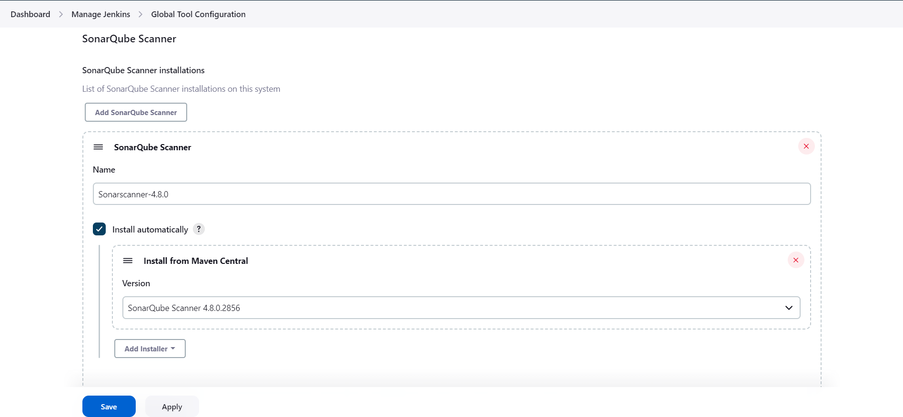
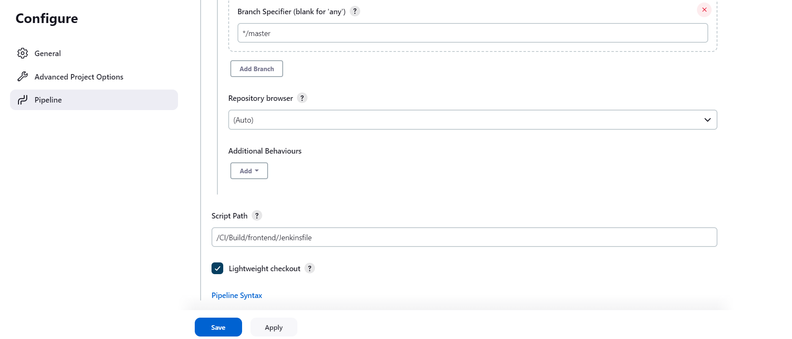

# Shipping

The shipping component is written using Java, it implements the functionality of shipping functionality of website.

</br>

## BUILD INSTRUCTION
---

The following steps are to be performed to build the cart component

- **TEST CODE QUALITY**
 
    **[ Note before moving on to this step complete the [_sonarqube-setup_](../../CD), [_jenkins-setup_](../../CD) ]**

    1. **STEP 1** - Create a repository in github and unzip [_shipping-source-code_](../../Source-Code/shipping/shipping.zip) and place the unzipped files under code directory, copy the [Code-Quality-Jenkinsfile](Code-Quality-Jenkinsfile), [sonar-project.properties](sonar-project.properties), to the root directory of the same repository. 

    </br>

    2. **STEP 2** - Install and Configure SonarScanner jenkins pulgin, follow the below steps :-

        - Login in to jenkins console, go to **Jenkins Dashboard > Manage Jenkins > Manage Pulgins > Available Pulgins > Search for SonarScanner Pulgin > Select the pulgin > Click Download now and install after restart**

        </br>

        

       </br>

       -  Once Downloaded , click on restart jenkins.
       </br>
 
       - Create sonar authenticatio token for jenkins , do the following **login into the Sonarqube server > Go to Administration tab > security > Users > Click on the icon below Token**

        </br>

        

        <br>

        - In the dialogue box that appears **Give a Name > Select expiration period > Click Generate**

        </br>

        
        
        <br>

        - Copy the generated Token.

        </br>

        

        </br>

        - Save token as secret in  Jenkins **Go to Manage Jenkins > Credentials > System > Global credentials > Click on Add credential on top right > Select Secret Text > Scope global > Paste the generated token in Secret > Give a random ID and description > Click create**

        </br>

        
       
        </br>

        - Add Sonarqube sever configuration in Jenkins **Go to Manage Jenkins > Configure System > Scrool down to SonarQube server > Check Environmental variable > Click Add SonarQube**

        </br>

        
        
        </br>

        - In the dialogue box that opens **Give name as sonar-server [ _dont change_ ] > Give Server URL in following format "_http://{sonarqube-server-IP}:{sonarqube-port}_" > Select the previously added token for Server authentication Token > Click Save**

        </br>

        
        
        </br>

        - Install SonarScanner for analysis in Jenkins **Go to Jenkins > Manage Jenkins > Global Tool Configuration > Scrool down to SonarQube Scanner section > Click on Add SonarQube Scanner**

        </br>

        
       
        </br>

        - In the dialogue box that opens **Give the name as Sonarscanner-4.8.0 [ _dont change_ ] > Select install automatically > Install from Maven Central > Select the 4.8.0 version > Click Save**

        </br>

        
        
        </br>

    2. **STEP 3** - Create Webhook for jenkins in sonar to communicate the quality gate passing. Follow the below steps

        - Login to SonarQube server **Go to Administration > Configuration > Select Webhook > Click create**

        </br>

        
        
        </br>

        - In the dialogue box that opens **Give a random name > Give the URL as follows "_http://{jenkins-server-IP}:{jenkins-port}/sonarqube-weebhook/_" > Leave secret as empty > Click Create**

        </br>

        

        </br>


    2. **STEP 4** - Create a SonarQube Project and setup quality gates, Follow the below steps.

        - Login to SonarQube Server **Go to Projects > Select Manual**

        </br>

        

        </br>

        - In the next page **Give a Project Name > Project Key > Leave branch as main > Click Setup**

        </br>

        

        </br>

        - In the next page **Select With Jenkins > Skip through the tutorial presented and setup the project**

        </br>

        

        </br>

        - Inorder to setup quality gates for the project **Go to Quality Gates > Click Create > In the dialogue box that appears > Select the Quality profile > Select the metrics and passing score > Click create**


        </br>

    1. **STEP 5** - Create Jenkins job to perfrom code quality analysis, follow the below steps.
     
        - Create the [Code-Quality-Jenkinsfile](Code-Quality-Jenkinsfile) [ **_don't change the filename_** ] file with the necessary steps to run in jenkins job.


        - Login to the jenkins console,
        Create an job by cliking on **New Item > Select Pipeline > Enter the name of the job > Ok**

        </br>

        

        </br>


        - Configure the created jenkins job, setup the Pipelince section **Choose Pipeline script fron SCM > Setup Respository URL > Setup the credentials > Set the branch specfier to main branch of your remote repo > Set the Script Path to _/CI/Build/shipping/Code-Quality-Jenkinsfile_ > Click Save**


        - Configure github webhook **Login to Github > Go to the specific repository > Settings > Webhook > Add webhook > Payload URL as "jenkins URL:port/github-webhook/" > Content type as _application/json_ > Add webhook**

        </br>


        

        </br>

        - Go back to jenkins **Select the created Job > Configure > Build Triggers > Select _GitHub hook trigger for GITScm polling_ > Click save**  ( _This is enabled so that job gets triggered automatically when new commits are made to source code repo in GitHub_ )
        
        </br>

        


</br>

- **CREATE CONTAINER IMAGE**

    1. **STEP 1** - Create the [Dockerfile](Dockerfile) [ **_don't change the filename_** ] file with the necessary instruction to build docker image. 

    2. **STEP 2** - Create the [Jenkinsfile](Jenkinsfile) [ **_don't change the filename_** ] file with the necessary steps to run in jenkins job.

    2. **STEP 3** -  Create a Jenkins job [ **complete the [jenkins_setup](../../CD) section before performing this step** ], follow the mentioned steps below.

        - Login to the jenkins console, use the username and password setup in the [jenkins_setup](../Images/../../CD) section

        </br>

        

        </br>
        
        - Create an job by cliking on **New Item > Select Pipeline > Enter the name of the job > Ok**
        
        </br>

        

        </br>

        - Configure the created jenkins job, setup the Pipelince section **Choose Pipeline script fron SCM > Setup Respository URL > Setup the credentials > Set the branch specfier to main branch of your remote repo > Set the Script Path to _/CI/Build/shipping/Jenkinsfile_ > Click Save**

        </br>
        
        

        </br>

        

        </br>


    4. **STEP-4** - Setup nexus repository [_refer_](../../CD), and then configure a new docker repo by following the below mentioned steps 

        -  Click on **Settings option on top menu bar >   Repository in left pane > Choose docker(hosted)**

         </br>

         

         </br>

        -  Now **Enter a repository name > Enter a preffered HTTP port (use a port different fro the one used in other repo) > Enable Docker API > Create Repository**

        </br>

         

         </br>
 

    2. **STEP-5** - Configure nexus user credentials in jenkins. ( not needed if alreaady done in frontend build ) 

        - **Go to Jenkins Dashboard > Manage Jenkins > Under security manage credentials > System > Global credentials > Add credentials.** 

        </br>

        

        </br>

        - In new crendentials dropdown **Select Secret Text > Scope Global > In Secret input nexus admin password > Id "nexus-password" > Description "nexus-password" > Click create**.
        
        </br>

        

        
        </br>

    2. **STEP-6** - Setup the downstream job necessary to update the helm chart files [ [**_here_**](https://github.com/sai-harsha-dev/DevOps_Project_HelmChart.git) ] with updated Image tag to the manifest files. Do the following steps in jenkins console.
        
        -  Install the **Git Publish** pulgin before configuring the job, follow these steps **Go to Jenkins Dashboard > Manage Jenkins > Manage Pulgins > Available Pulgins > "Git plugin" >
        Check Download and Install after restart**

        </br>

        

        </br>

        
        
        </br>
 

        -  After restarting the server, Configure the jenkins downstream job from **Jenkins Dashboard > New Item > Select Freestyle job > Give a name to the job > Click OK**

        </br>

        

        </br>

        - Configure the job as follows **Check This project is parameterized option > Select string parameter > Give a name ( _should be same a given in [jenkins](Jenkinsfile) file post section parameters_ ) > Give a default value.**

        </br>

         
        
        </br>


        

        </br>

        - Login into Github and generate github tokens using the following steps **Under Profile icon select Settings > In the left menu bar Developer setting > Personal access token > Tokens ( classic ) > Generate new token > Generate new token ( classic )**

        </br>

        

        </br>

        - **Give a note > Expiration period > Select Scope (_Click Rep_) > Generate Token > Copy the Token**

        </br>

        - Go back to Jenkins job configuration console in the Source Code Management section **Select Git > Give repository URL (_git repo where helm charts are found i.e [**_here_**](https://github.com/sai-harsha-dev/DevOps_Project_HelmChart.git)) > Select the credentials > Add Credentials > Jenkins > Select Username and Password > Global > Under Username your git profile name > Password the generated token > ID random name > Description random > Click Add > Input branch specifier as per your main branch name**

        </br>

        
        

        </br>
        
        

        </br>

        - In the build steps **Click Add build step > Select Execute Shell > In the Command section give the following commands.**

        </br>

        ```console
           sed -i '/^image:.*$/d' templates/shipping/values.yaml
           echo "image: ${IMAGE}" >> templates/shipping/values.yaml 
           git add templates/shipping/values.yaml
           git commit -m "updated image to ${IMAGE}" 
        ```
        
        </br>

        
        
        </br>

        - In Post Build Section **Add post build action > Git publisher > Select Push Only If Build Succeeds > Input remote branch to push to in Branch to push > The remote url (_i.e upstream URL_) name in Target remote name > Click Save.**

        </br>

        
        
        </br>

        

        </br>
        
    2. **STEP-7** - Go to the jenkins upstream-job ( _**Refer STEP 3**_ ) and perform following steps to build frontend image & Trigger downstream job to update image tag in helm charts  ( not needed if alreaady done in frontend build ) 

        - Add jenkins user to docker group, run the following commands by SSHing into jenkins server. ( Done to avoid prefixing sudo with docker commands )

            ```console
            ubuntu@ip-172-31-83-151:~$ sudo usermod -aG docker jenkins
            ubuntu@ip-172-31-83-151:~$ sudo systemctl restart jenkins
            ```

        - **Login to the jenkins console > Click on the created job > Enter the parameter values (run once to get the listing) > Build with parameters.** 

        </br>

        
        

        </br>

### Next Step
---

Go to the [_Build_](../../Build/) for folder for instructions to build the rest of the components left. 
        

        

        
    
          