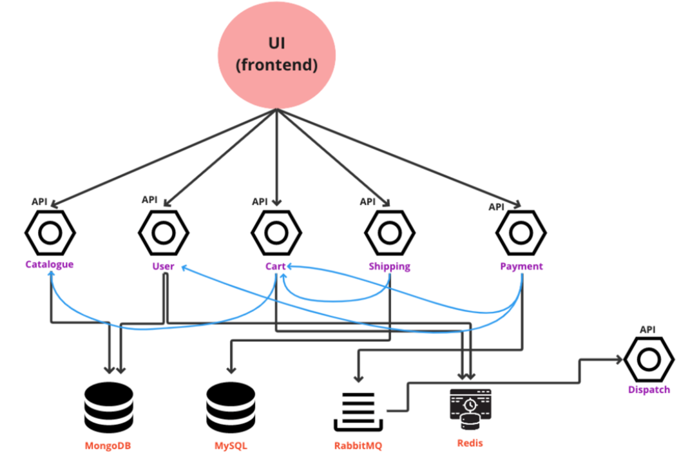

# Application Setup

# Application Components

The application used for the CI-CD demonstration consists of the following components :-

1. **FRONTEND** - This component has the source code for generating User Interface that is presented over the web for end user interaction, Click [_here_](./frontend) for the source code.
