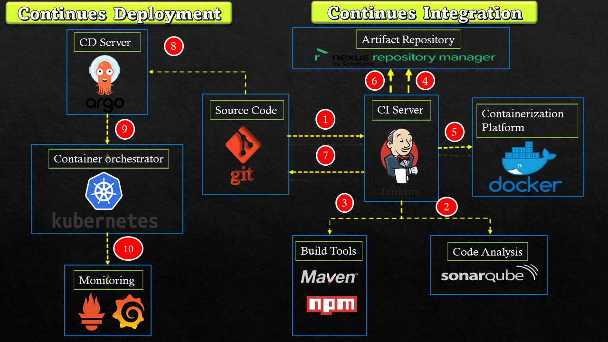

# DevOps_Project
This is a sample website with multiple components used to demonstrate the different stages of CI/CD pipeline.

## Setup Workflow
---

The above image illustrates the CI-CD workflow and component enabling each stage of the CI-CD workflow used in this project.

## Setup Components
---
The complete setup consists of following component's elaborated below :- 

1.  **Source Code** :- The source code includes 

    - CI Components Code - Includes the necessary code files to configure CI components. For more details refer [_CI_](./CI/) folder
      
    - CD Components Code - Includes the necessary code files to configure CD components. For more details refer [_CD_](./CD/) folder

    - Infrastructure Code - Includes the necessary code files to configure Infrastructure components. For more details refer [_Infra_](./Infra/) folder

2. **CI Server** - Elaborated as Continues intergration Server, for more details of the configuration and functions refer [_CI_](./CI/) folder.

3. **Code Analysis** - This component is used to test the quality of the source code, for more details of the configuration and functions refer [_CI_](./CI/) folder.

4. **Build Tools** - This components consists of the necessary software components used to build the artifacts from source code, for more details of the configuration and functions refer [_CI_](./CI/) folder.

5. **Containerization Platform** - This component is used for building container images from the source code, for more details of the configuration and functions refer [_CI_](./CI/) folder.

6. **Artifact Repository** - This components is used for centralised storage of the artifacts/Images build for this project, for more details of the configuration and functions refer [_CI_](./CI/) folder.

7. **CD Server** - Elaborated as Continues deployment server is used for deployment of build artifacts,  for more details of the configuration and functions refer [_CD_](./CD/) folder.

8. **Container Orchestrator** - This component is used to deploy the application containers,   for more details of the configuration and functions refer [_CD_](./CD/) folder.
  
9. **Monitoring** - This component is used to monitor the health of deployed application,   for more details of the configuration and functions refer [_CD_](./CD/) folder.

## Setup Stages 
---
The whole setup involves 10 stages to be configured, elaborated below :-

#### \*\* NOTE :- _The sequence of steps followed is indicated in the [_Setup Workflow_](#setup-workflow) with a numbered circle icon besides the flow arrow symbol_ \*\* 

 

1. **GIT repository webhook to Jenkins** - Refer [_CI_](./CI/)

2. **Code Quality Analysis** - Refer [_CI_](./CI/)

3. **Build Application Artifacts** - Refer [_CI_](./CI/)

4. **Store Built artifacts in Artifacts Repository** - Refer [_CI_](./CI/)

5. **Built container Images from built artifacts** - Refer [_CI_](./CI/)

6. **Store the built Image in Artifact repository** - Refer [_CI_](./CI/)

7. **Update Image tag in manifast files** - Refer [_CI_](./CI/)

8. **Monitor source manifest files and trigger new deployment** - Refer [_CD_](./CD/)

9. **Setup and run application containers in Kubernetes** - Refer [_CD_](./CD/)

10. **Monitor application health in Kubernetes** - Refer [_CD_](./CD/)

  
  

